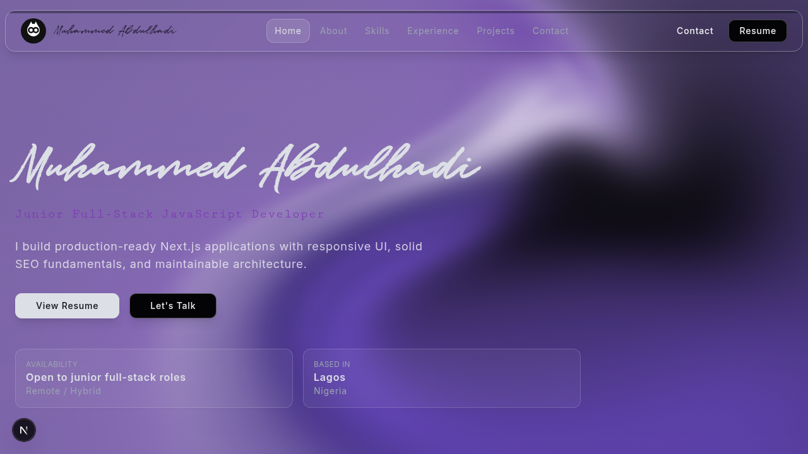

# Muhammed Abdulhadi — Developer Portfolio

[](https://mrglasswillbreak.vercel.app)
[](https://nextjs.org/)
[](https://react.dev/)
[](https://www.typescriptlang.org/)
[](https://tailwindcss.com/)
[](https://vercel.com/analytics)

A production-ready personal portfolio built with the **Next.js 15 App Router**, React 19, and Tailwind CSS. Features section-aware navigation, animated UI transitions, a responsive project showcase, and a built-in contact form with server-side email delivery.

> **Live at:** [mrglasswillbreak.vercel.app](https://mrglasswillbreak.vercel.app)

---

## Preview



---

## Features

- **Section-aware navigation** with scroll progress indicator and smooth scrolling
- **Responsive project showcase** with toggle between curated highlights and live GitHub data
- **Contact form** with server-side email delivery via Nodemailer
- **SEO foundation** including Open Graph, Twitter cards, structured data, robots, and sitemap routes
- **Animated UI** using the Motion library with accessibility-conscious reduced-motion support
- **Self-hosted fonts** (Inter and Cutive Mono via `@fontsource`) for reliable offline builds
- **PDF resume viewer** with an error boundary and fullscreen support

---

## Tech Stack

| Layer | Technologies |
|---|---|
| **Framework** | Next.js 15 (App Router), React 19, TypeScript |
| **Styling** | Tailwind CSS, CSS variables, custom glass-morphism design system |
| **Animation** | Motion (Framer Motion), CSS keyframes |
| **UI Components** | Radix UI primitives, React Icons, custom component library |
| **Backend** | Next.js API routes, Nodemailer |
| **Deployment** | Vercel (with Analytics) |

---

## Project Structure

```text
src/
├── app/
│   ├── (main)/page.tsx          # homepage with all sections
│   ├── api/send/                # contact form API route
│   ├── resume/                  # resume viewer page
│   ├── layout.tsx               # root layout, metadata, structured data
│   ├── not-found.tsx            # custom 404 page
│   ├── fonts.ts                 # self-hosted font configuration
│   ├── robots.ts                # robots.txt generation
│   └── sitemap.ts               # sitemap generation
├── components/
│   ├── sections/                # Hero, About, Skills, Experience, Projects, Contact
│   ├── Cards/                   # ProjectCard, ExperienceCard, SkillsCard, ContactFormCard
│   ├── common/                  # Navbar, Footer, Background, PreLoader
│   ├── ui/                      # Button, Card, Badge primitives
│   └── template/                # Email templates
├── constant/                    # Content data (self, projects, experience, skills)
├── lib/                         # Utilities, structured data helpers, image processing
└── assets/                      # Local fonts and images
```

---

## Getting Started

### Prerequisites

- Node.js 18+
- npm

### Installation

```bash
npm install
npm run dev
```

Open [http://localhost:3000](http://localhost:3000) in your browser.

### Build and Lint

```bash
npm run lint
npm run build
npm run start
```

> Fonts are self-hosted via `@fontsource`, so builds do not depend on external font CDNs.

---

## Environment Variables

The contact form requires the following variables in a `.env` file:

| Variable | Description |
|---|---|
| `email_from` | Sender email address |
| `email_password` | App-specific email password |
| `QEV_API_KEY` | QuickEmailVerification API key |

---

## Customization

To adapt this portfolio for your own use, update these content files:

| File | Purpose |
|---|---|
| `src/constant/self.ts` | Name, role, bio, socials, availability |
| `src/constant/experience.ts` | Work and training timeline |
| `src/constant/projects.ts` | Featured project cards and links |
| `src/constant/skillsData.tsx` | Grouped skill set visuals |

---

## Contact

- **GitHub:** [mrglasswillbreak](https://github.com/mrglasswillbreak)
- **LinkedIn:** [Muhammed Abdulhadi](https://www.linkedin.com/in/muhammed-abdulhadi-7b9ba2278)
- **X:** [@mrglaswontbreak](https://x.com/mrglaswontbreak)
