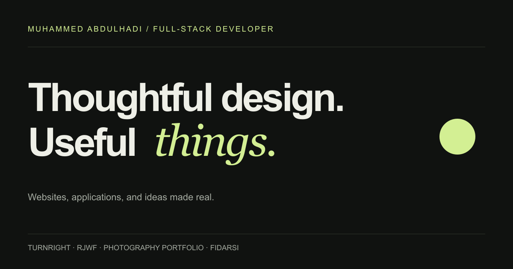

# Muhammed Abdulhadi — Portfolio

A project-led portfolio for my full-stack development work, built with Next.js App Router, TypeScript, and Tailwind CSS.

[Visit the portfolio](https://mrglasswillbreak.vercel.app) · [GitHub profile](https://github.com/mrglasswillbreak) · [Résumé](https://mrglasswillbreak.vercel.app/resume)



## Selected projects

| Project               | Focus                                                                              | Case study                                                                 |
| --------------------- | ---------------------------------------------------------------------------------- | -------------------------------------------------------------------------- |
| TurnRight             | LASU Ojo campus navigation, offline maps, routing, 3D buildings, and owner editing | [Read](https://mrglasswillbreak.vercel.app/projects/turnright)             |
| RJWF                  | Nonprofit website and private visual content studio                                | [Read](https://mrglasswillbreak.vercel.app/projects/rjwf)                  |
| Photography Portfolio | Photography gallery, CMS, and first-party analytics                                | [Read](https://mrglasswillbreak.vercel.app/projects/photography-portfolio) |
| Fidarsi               | Corporate website and protected registration workflows                             | [Read](https://mrglasswillbreak.vercel.app/projects/fidarsi)               |

The homepage and case studies use a shared, typed project catalog. Screenshots are local optimized WebP assets; their sources and capture details are documented in [SOURCES.md](public/images/projects/SOURCES.md). Only public repositories receive source-code links.

## Development

Use Node.js 22.13+ and npm.

```sh
npm ci
npm run dev
```

Open the local address printed by Next.js.

```sh
npm run lint
npm run typecheck
npm test
npm run build
npm start
```

Tests exercise contact validation and delivery failures through injected dependencies, plus the form’s pending, success, retry, and error states with a simulated DOM. They never send real emails. Type checking requires generated Next.js types, available after the first build or development run.

## Content and routes

- `src/constant/projects.ts`: the four project summaries, images, links, and case-study content.
- `src/lib/site.ts`: canonical URL, contact details, social links, and résumé path.
- `src/components/sections/`: homepage introduction, work, background, experience, and contact.
- `src/app/projects/[slug]/page.tsx`: statically generated case studies.
- `src/app/globals.css`: the responsive charcoal/lime design system and reduced-motion styles.
- `/resume`: viewer and download links for the existing résumé PDF.
- `/api/send`: contact handler; request fields remain `senderName`, `senderEmail`, `reasonToContact`, and `senderMsg`.

The PDF retains its existing asset filename for link compatibility; its download label uses Muhammed Abdulhadi.

## Contact configuration

Set server-side variables in the deployment environment:

| Variable         | Purpose                                                                                            |
| ---------------- | -------------------------------------------------------------------------------------------------- |
| `email_from`     | Gmail address used to send contact messages                                                        |
| `email_password` | Gmail app password                                                                                 |
| `QEV_API_KEY`    | Optional QuickEmailVerification key; verification uses HTTPS and a bounded timeout when configured |

Messages are delivered to **mrglasswillbreak@gmail.com**. Invalid input is rejected before external calls. Missing SMTP configuration returns an explicit unavailable response with a direct-email fallback. The owner’s accepted message determines success; a failed courtesy acknowledgement does not mark that message as undelivered. Contact details and provider responses are not logged.

## Publishing

The production branch is `master`, connected to the existing Vercel deployment. Verify the build and local preview before publishing. Metadata, sitemap, robots, social previews, and structured data use `https://mrglasswillbreak.vercel.app`.

The GitHub profile README lives in the separate [mrGlassWillBreak repository](https://github.com/mrglasswillbreak/mrGlassWillBreak); its project images reference the public screenshot assets here.

## Design and accessibility

Server-rendered content, self-hosted Inter and Cutive Mono, semantic headings, keyboard-visible focus, a skip link, responsive navigation, explicit image dimensions, and reduced-motion support. Project images below the fold load lazily. The homepage has no forced loading screen or live GitHub API dependency.
